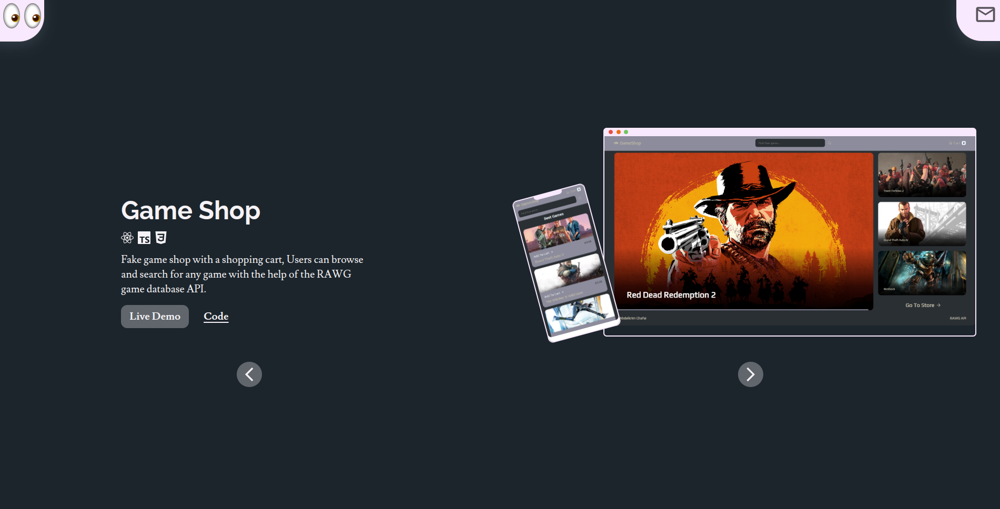

	<h1>My Protfolio
	 
		
		
		
		
		 
	</h1>
	<h3> 👇 Check It Out 👇 </h3>

## 📝 Description

My Personal Protfolio Website.

## 🛠️ Built with

- React 
- TypeScript 
- Vite 
- Tailwindcss 
- Framer-Motion 
- ESLint 
- Prettier 
